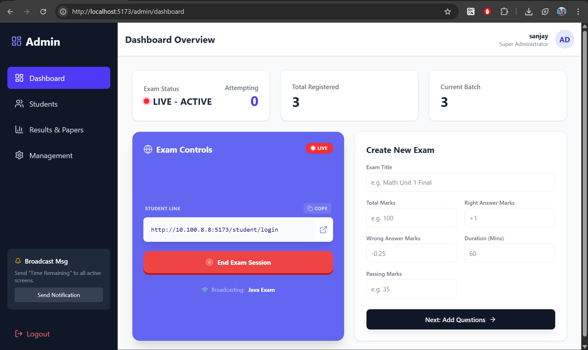
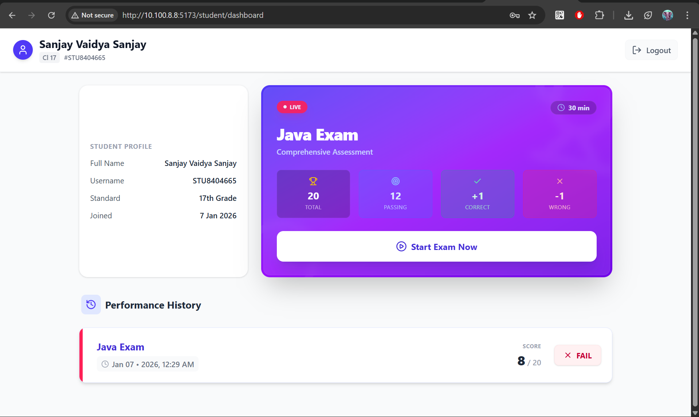

# 🎓 ClassQuiz – Classroom Quiz & Exam Management System

**ClassQuiz** is a **local-network based classroom quiz system** designed for teachers to conduct **live exams without internet hosting**.  
The **teacher’s PC acts as the server**, and students connect using the **same Wi-Fi / hotspot network**.

---

## 📌 Key Highlights

- 🖥 Server runs on teacher’s PC
- 📱 Students join via local IP (Wi-Fi / Hotspot)
- ⚡ Live exam start / stop
- 📊 Real-time student activity tracking
- 🧠 MCQ-based quiz system
- 🗂 Bulk question upload & update
- 📅 Date-based student activation management
- 🔐 Simple authentication (no JWT – classroom-only usage)

---

## 📸 Screenshots

|                  **Admin Dashboard**                  |                   **Student Dashboard**                   |
| :---------------------------------------------------: | :-------------------------------------------------------: |
|  |  |
|         _Manage exams, students, and results_         |           _Join live exams and submit answers_            |

---

## 🧱 Tech Stack

### Backend

- Java 17
- Spring Boot
- Spring Data JPA
- Hibernate
- MySQL
- Lombok

### Frontend

- React (Vite)
- Axios
- Tailwind CSS
- React Router
- Lucide Icons

---

## 🏗 Architecture Overview

```
Teacher PC
├── Spring Boot Server (Port 8080)
├── MySQL Database
└── React Admin Panel (Port 5173)

Students (Mobile / PC)
└── React Student UI
└── Connects via teacher PC IPv4
```

---

## 👥 User Roles

### 👨‍🏫 Admin (Teacher)

- Login to admin panel
- Create exams
- Upload & manage questions
- Start / stop live exams
- Add students
- Monitor active students
- Publish results
- Enable / disable students by date range

### 👨‍🎓 Student

- Login using assigned credentials
- Join live exam
- Attempt quiz
- Auto submit on time expiry
- Submit answers manually

---

## ⏱ Live Exam Flow

1. Admin starts exam → `isLive = true`
2. Students fetch quiz → `isGivingExam = true`
3. Timer starts on frontend
4. Student submits OR time expires
5. Answers saved in bulk
6. Result calculated & stored
7. `isGivingExam = false`
8. Admin publishes results

---

## 🌐 Network & IP Handling

- Server detects teacher PC IPv4 automatically
- Stored in `localStorage`
- Used dynamically by:
  - Student APIs
  - Student exam links
- No hardcoded IPs

---

## 🔗 Network-Based Access (Important)

- Admin runs backend on laptop
- Backend detects IPv4 automatically
- Students connect using same Wi-Fi / hotspot
- Exam link works **only inside that network**  
  👉 Secure & offline-friendly

---

## 📁 Project Structure

### 🔹 Frontend (`/frontend/src`)

```
src/
├── features/
│   ├── admin/
│   │   ├── components/     # ExamControls, QuizReview, ResultView
│   │   ├── hooks/          # adminHooks.js
│   │   ├── models/         # AddStudentModel, UploadQuestionsModel
│   │   └── pages/          # DashboardPage, LoginPage
│   └── student/
│       ├── hooks/          # studentHooks.js
│       └── pages/          # StudentLogin, QuizInterface
├── routes/                 # AppRoutes, ProtectedRoutes
├── services/               # API Services (admin/student)
├── axios/                  # Axios Instances & Interceptors
└── systemIP.js             # Local IP Logic
```

---

### 🔹 Backend (`/backend/src/main/java/com/classquiz`)

```
com.classquiz
├── adminRole/              # Admin Controllers (Exam, Quiz, Student, Result)
├── studentRole/            # Student Controllers (Exam, Quiz, Result)
├── auth/                   # Authentication Logic
├── domain/                 # Entities (Admin, Student, Exam, Quiz, Result)
├── config/                 # WebConfig (CORS, etc.)
├── system/                 # SystemController (IP Detection)
└── ServerApplication.java  # Main Entry Point
```

---

## 🗃 Database Schema Overview

### Tables

| Table Name      | Description                            |
| --------------- | -------------------------------------- |
| admin           | Stores admin login credentials         |
| students        | Stores student details & exam activity |
| exams           | Exam configuration                     |
| quiz            | Questions linked to exams              |
| student_answers | Answers submitted by students          |
| result_overview | Final exam results per student         |

---

### 🔗 Relationships

- `exams` → `quiz` (One-to-Many)
- `students` → `student_answers` (One-to-Many)
- `quiz` → `student_answers` (One-to-Many)
- `students` → `result_overview` (One-to-One)

---

## 🔐 Authentication Strategy

- No JWT / OAuth
- Classroom-only usage
- Simple session-like flow
- Student ID sent via Axios interceptor header

---

## 🛡 Safety & Best Practices

- Correct answers **never sent** to students
- Exam locked when `isLive = true`
- Bulk operations wrapped in transactions
- Cascade delete: `Exam → Quiz`
- Auto exit handling using `navigator.sendBeacon`

---

## 🚀 Future Enhancements

- Result analytics dashboard
- Section-wise exams
- Question shuffling
- Option shuffling
- Export results (Excel / PDF)
- Attendance reports
- Role-based permissions

---

## 🏁 Conclusion

**ClassQuiz** is a lightweight, offline-friendly, classroom-focused exam system built with real-world constraints in mind.  
It avoids unnecessary complexity while still following **industry-grade backend practices**.

---

## 📄 License

Distributed under the MIT License. See LICENSE for more information.
